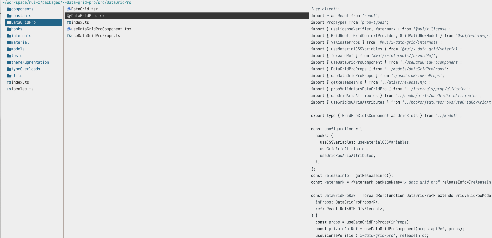

<div align="center">
  
</div>

<h3 align="center">
	Zenbones Light Flavor for <a href="https://github.com/sxyazi/yazi">Yazi</a>
</h3>

## 👀 Preview



## 🎨 Installation

<!-- Please replace "username/example" with your repository name. -->

```sh
ya pack -a tp6gw94/zenbones-light
```

## ⚙️ Usage

<!--
Please replace "example" with your flavor name.

If your flavor uses a light color scheme, use "light" instead of "dark" wherever it appears below.
-->

To set it as your dark flavor, change the content of your `theme.toml` to:

```toml
[flavor]
light = "zenbones-light"
```

Make sure your `theme.toml` doesn't contain anything other than `[flavor]`, unless you want to override certain styles of this flavor.

See the [Yazi flavor documentation](https://yazi-rs.github.io/docs/flavors/overview) for more details.

## 📜 License

This project incorporates elements derived from the Zenbones theme, which is licensed under the MIT License. For further details, please see the [THIRD_PARTY_LICENSES](THIRD_PARTY_LICENSES) file.

Both the flavor and the included tmTheme in this project are also released under the MIT License.

For complete licensing information, please refer to the [LICENSE](LICENSE) and [LICENSE-tmtheme](LICENSE-tmtheme) files.

## Inspired by

[zenbones.nvim](https://github.com/zenbones-theme/zenbones.nvim)
